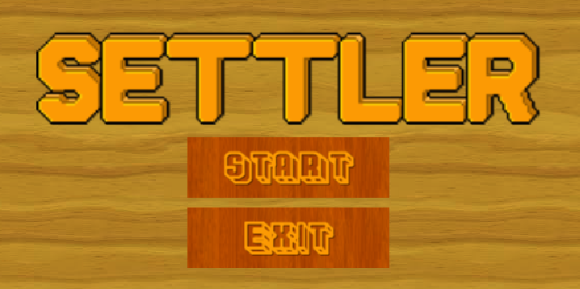
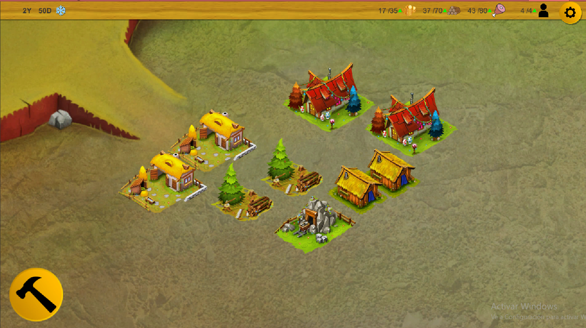

# Settler Project

### What is Settler?

It's a resource manager/idle game where you have a village and you must make it grow.
You have 3 resources: gold, wood and food. This resources are needed to build and upgrade buildings. 
Also you have population who makes the builds produce and they consum food, so if you don't watch it, they will starve to dead.

Now the main objective is to produce 50 gold resources, but in a future we want it to be infinite.

### The project

To acomplish this project we implement 3 main features:

* The isometric tile map. Using unity's isometric tilemap we can display the vilage with all th buildings. Also we have implemented the possibility that the player can place the buildings with the mouse and block it if there is an intersecction between buildings.
* We have created a game manager where we save all the building instances and we compute all the resources gains and losses.
* We made the building as a complex SriptableObject. It makes easier to edit all the the parameters like sizes o multipliers. Also we made that all the building UI are generated dynamicaly from de model, for example the buy button or the building details.

Also we created a timer, a popup system and a audio manager.

# Future work

We have a lot of things we can improve in this game, one of the main things is the UI. Now we have a very functional (and ugly) interface that can be easily impoved with some predesign panels and buttons and some animations. Not only it improve the visual part of the game, but also the feel and feedback given to the user.

Another thing we can improve is the gameplay part. We can add more buildings and resources to add diversity and we can add random events to engage the player.
